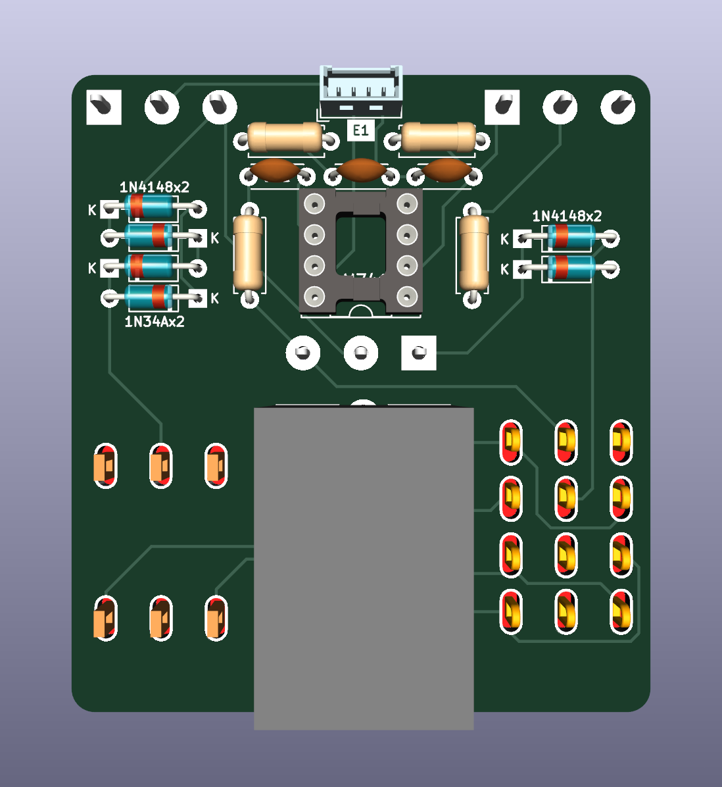
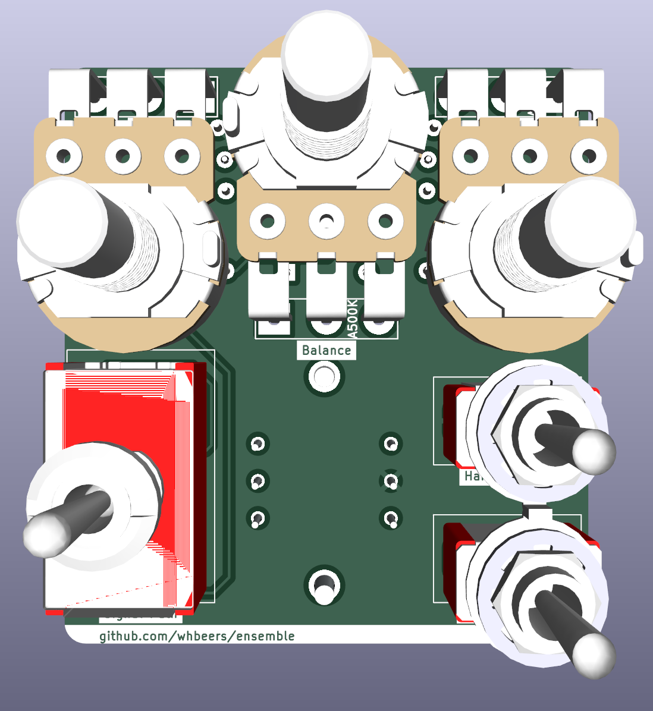
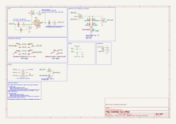

# Ensemble Fuzz Effect

This is a semi-original octave fuzz, based most directly on the Death By Audio "Octave Clang", but with many of my own tweaks and additions. Designed in [KiCAD](https://www.kicad.org).

The board is built on the ["Noise Floor"](https://github.com/whbeers/noise_floor) pedal platform, which provides basic power protection, audio IO, and a footswitch with LED indicator.

[Schematic PDF](schematics/ensemble-latest.pdf)

## Credit
I drew inspiration from a number of publicly-available octave fuzz schematics, but most directly public traces of the out-of-production [Death By Audio](https://deathbyaudio.com/) "Octave Clang" as portrayed in the PCBGuitarMania ["Death by Octaver" schematic](https://pcbguitarmania.com/product/death-by-octaver/), and by various contributors to the [thread at freestomboxes.org](https://www.freestompboxes.org/viewtopic.php?t=11122). I became interested in the effect after hearing the original maker, Oliver Ackermann, [demonstrate the Octave Clang](https://youtu.be/_RslAoTyIwk?t=2671) in a feature on EarthQuaker Devices' YouTube channel.

Thanks as always to the folks on the [freestompboxes.org](https://www.freestompboxes.org) forum for their feedback, suggestions, and the wealth of knowledge they provide for curious tinkerers like myself.

*I am not affiliated with any of the brands, sites, or products named in this overview.*

## My Modifications
Using what I could find out about Octave Clang as a basis, my circuit makes the following modifications:
 - added flexibility through three switchable voices for the octave stage:
   1. primary->secondary, full winding: a subtle driven octave effect
   2. secondary->primary, full winding: a clangorous metallic octave, most similar to the public demos of the Octave Clang
   3. secondary->primary, half winding: an even louder and more overt octave effect, thanks to the higher effective ratio of turns between secondary and primary windings. In this mode the octave effect is evident throughout most of the fretboard.
 - added a balance control to give further flexibility in the level of octave effect vs drive
 - added a (switchable) hard clipping stage to rein in the overall output level and add a very distinct, but still octave fuzz voice to the effect
 - tweaked component values to make the effect slightly more accessible across a range of volumes and gains (and to use more commonly-available values)
 - omitted the input-side tone control pot, as it tended to attenuate the signal to an unhelpful degree

## Versioning

My pcb designs utilize the following versioning scheme (I'll add to this as I produce more revisions):
 - v0.0XX: A candidate design that has not yet been produced and tested.
 - v0.XX: A design that has been produced, tested, and any initial errors addressed.

## Name
*The name "Ensemble" is a reflection of the nature of the effect (a blend of various octave fuzz and drive voices) and [security nerdery](https://www.usenix.org/system/files/sec19-chen-yuanliang.pdf).*
